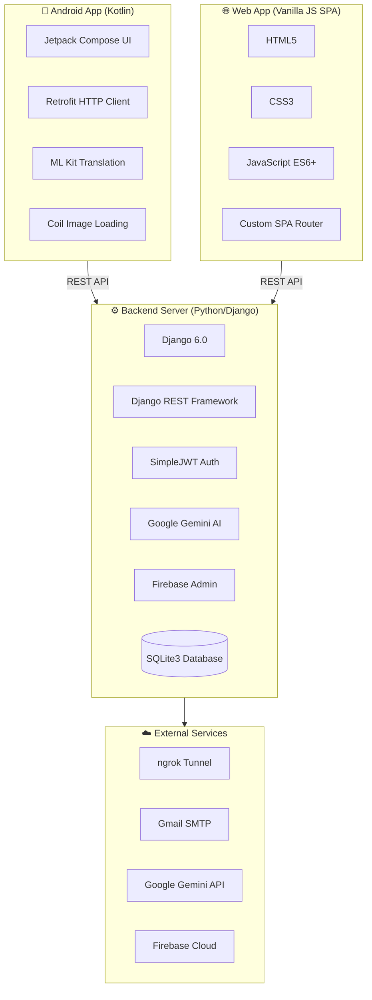

# MotivBooks

AI-integrated e-book platform spanning a native Android app, a Django REST backend, and a vanilla-JS web SPA — solo-designed and built end to end.

## Overview

MotivBooks lets users read e-books with AI-powered features layered on top: an in-app reading coach powered by Google Gemini AI, on-device translation via Google ML Kit, reading-progress tracking, journaling, and gamified challenges/badges. The project consolidates what began as two separate repositories into a single monorepo (merged with `git subtree`, resolving divergent Git histories along the way). Not currently distributed on the Google Play Store — Play Store assets are prepped but unpublished.

## Architecture

## 📱 Android App

| Category | Technology | Version | Purpose |
|---|---|---|---|
| Language | Kotlin | Latest | Primary programming language |
| UI Framework | Jetpack Compose | BOM-managed | Declarative modern Android UI |
| UI Toolkit | Material Design 3 | BOM-managed | Material You components & theming |
| Build System | Gradle (Kotlin DSL) | 8.x | Build automation & dependency management |
| Min SDK | Android 7.0 (API 24) | — | Minimum supported Android version |
| Target SDK | Android 15 (API 35) | — | Target Android version |
| JVM Target | Java 17 | — | Kotlin compilation target |

**Libraries:** `androidx.navigation:navigation-compose` 2.8.5 (navigation) · `androidx.lifecycle:lifecycle-viewmodel-compose` 2.8.7 (ViewModel + Compose) · `androidx.compose.material.icons.extended` (icon set) · `com.squareup.retrofit2:retrofit` 2.9.0 + `converter-gson` 2.9.0 (REST client, JSON) · `com.google.mlkit:translate` 17.0.3 (on-device translation) · `io.coil-kt:coil-compose` 2.6.0 (async image loading) · `androidx.core.ktx`, `androidx.compose.foundation` (Compose primitives) · JUnit / Espresso (testing)

**App structure:** 22 screens (MVVM with ViewModels — `LoginScreen.kt`, `ReaderScreen.kt`, `DashboardScreen.kt`, etc.) · reusable composables (`AuthTextField.kt`, `GlassCard.kt`) · Material 3 theming (`Color.kt`, `Theme.kt`, `Type.kt`, `LocalReadingPreferences.kt`) · 12 Retrofit API interfaces (`AuthApi.kt`, `LibraryApi.kt`, etc.) · 10 Kotlin data model files (`AuthModels.kt`, `DashboardModels.kt`, etc.) · utilities (`SessionManager.kt`, `TranslationHelper.kt`, `NetworkUtils.kt`)

## ⚙️ Backend

| Category | Technology | Version | Purpose |
|---|---|---|---|
| Language | Python | 3.x | Primary backend language |
| Web Framework | Django | 6.0.2 | Full-featured web framework |
| API Framework | Django REST Framework | 3.16.1 | RESTful API endpoints |
| Auth | djangorestframework-simplejwt | 5.5.1 | JWT access/refresh token auth |
| CORS | django-cors-headers | 4.9.0 | Cross-origin resource sharing |
| Database | SQLite3 | Built-in | Relational database (dev) |
| Config | python-decouple | 3.8 | Environment variable management |
| Server interface | asgiref | 3.11.1 | Async server gateway interface |

**AI & cloud services:** `google-generativeai` 0.8.6 (Gemini AI — chat, summaries, daily boosts, AI coaching) · `firebase-admin` 7.3.0 (push notifications, device token management) · `google-cloud-firestore` 2.25.0 (Firestore NoSQL, via Firebase) · `google-cloud-storage` 3.10.0 (media/file hosting) · `google-auth` 2.49.1 (Google API auth)

**Data & media processing:** `Pillow` 12.1.1 (image processing — covers, avatars) · `PyPDF2` ≥3.0.1 (PDF parsing for book content) · `requests` 2.32.5 · `pydantic` 2.12.5 (validation/serialization) · `PyJWT` 2.11.0

**Data models (17 total):** `User` (custom email auth) · `UserProfile` (phone, DOB, location, avatar) · `UserProgress` (streaks, books read, hours, mood) · `GoalDetails` (reading goals/deadlines) · `ReadingAnalytics` (weekly stats) · `ReadingPreference` (font size, theme, language, interests) · `Subscription` (Free/Monthly/Yearly) · `Book` / `Chapter` (catalog + content) · `UserBook` (per-user progress) · `SavedQuote` · `DailyBoost` (AI-generated motivation) · `JournalEntry` (reflective journal with mood) · `Challenge` / `UserChallenge` (gamification) · `UserBadge` · `Notification` / `NotificationSetting` · `PasswordResetOTP` / `LoginOTP` · `DeviceToken` · `MindsetKB` (AI knowledge base Q&A)

40+ REST API endpoints across these models.

## 🌐 Web App (SPA)

| Category | Technology | Purpose |
|---|---|---|
| Language | JavaScript (ES6+) | Core logic, API calls, DOM manipulation |
| Markup | HTML5 | Page structure & semantic elements |
| Styling | Vanilla CSS3 | 38KB of handwritten styles |
| Architecture | Single Page Application | Custom hash-based router |
| Icons | Google Material Icons (Rounded) | UI iconography |
| API Layer | Fetch API | Native browser HTTP client |
| Auth Storage | localStorage | JWT token persistence |

**Pages (20 JS modules):** Welcome / Login / Register with OTP (`welcome.js`, `login.js`, `register.js`) · Dashboard (`dashboard.js`) · Library (`library.js`) · Reader (`reader.js`, ~18KB) · Progress (`progress.js`) · Journal (`journal.js`) · AI Coach (`ai-coach.js`) · Daily Boost (`daily-boost.js`) · Badges / Challenges (`badges.js`, `challenges.js`) · Profile / Settings (`profile.js`, `settings.js`) · Admin panel (`admin.js`, `admin-login.js`, `admin-chapters.js`) · Forgot / Change password (`forgot-password.js`, `change-password.js`) · Set Goal (`set-goal.js`)

## 🛡️ Static / Legal Pages

Plain HTML: Privacy Policy, Delete Account, Patent documentation (2-part), and a splash page.

## 🔧 DevOps & Tooling

Android Studio · VS Code · Gradle (Kotlin DSL) · pip / venv · Git · ngrok (tunnels the local Django server to the internet during development) · Gmail SMTP (OTP & password-reset emails)

## 📊 By the Numbers

| Metric | Count |
|---|---|
| Programming languages | 3 (Kotlin, Python, JavaScript) |
| Major frameworks | 4 (Jetpack Compose, Django, DRF, Material 3) |
| Android libraries | 10+ |
| Python packages | 30+ (direct + transitive) |
| Django models | 17 |
| Android screens | 22 |
| Web pages | 20 |
| API endpoints | 40+ |
| External services | 4 (Gemini AI, Firebase, Gmail SMTP, ngrok) |

## Status

Not distributed on the Google Play Store — Play Store listing assets are prepared but unpublished. The Android app was run and tested via local builds with the backend exposed through ngrok during development.

## Author

Built solo by [Uday Gudeti](https://github.com/Udaykiran96G).
